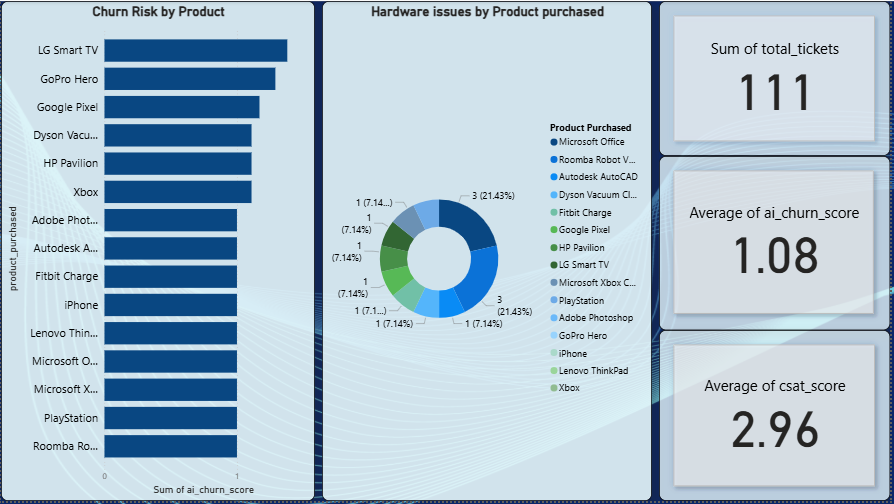

# AI-Powered Customer Support Analytics Pipeline

## 📌 Project Overview
An end-to-end data engineering and analytics project that processes unstructured customer support tickets using Large Language Models to predict churn risk and identify hardware/software defects. 

## 🛠️ Tech Stack
* **Python (Pandas):** Data manipulation and API handling.
* **Groq API (Llama 3.1):** Prompt engineering for sentiment analysis and categorization.
* **PostgreSQL:** Data storage and advanced aggregations (CTEs).
* **Power BI:** Executive dashboard design and data visualization.

## 🚀 The Pipeline
1. **Data Ingestion:** Processed raw CSV support tickets.
2. **AI Enrichment:** Sent unstructured text to Llama 3.1 to extract a `Churn_Risk_Score` (1-5) and a `Core_Issue` category.
3. **Database Architecture:** Built a local PostgreSQL database, handled null-value staging, and wrote analytical queries to find the highest-risk products.
4. **Visualization:** Designed an interactive Power BI dashboard for stakeholders to monitor hardware failures.

## 📊 Dashboard Preview

## 💡 Key Business Insight
The SQL analysis and Power BI dashboard revealed that the **LG Smart TV** had the highest average AI Churn Score, driven primarily by hardware defect complaints.
